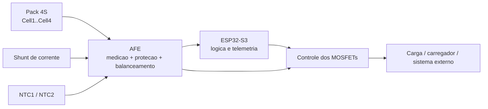
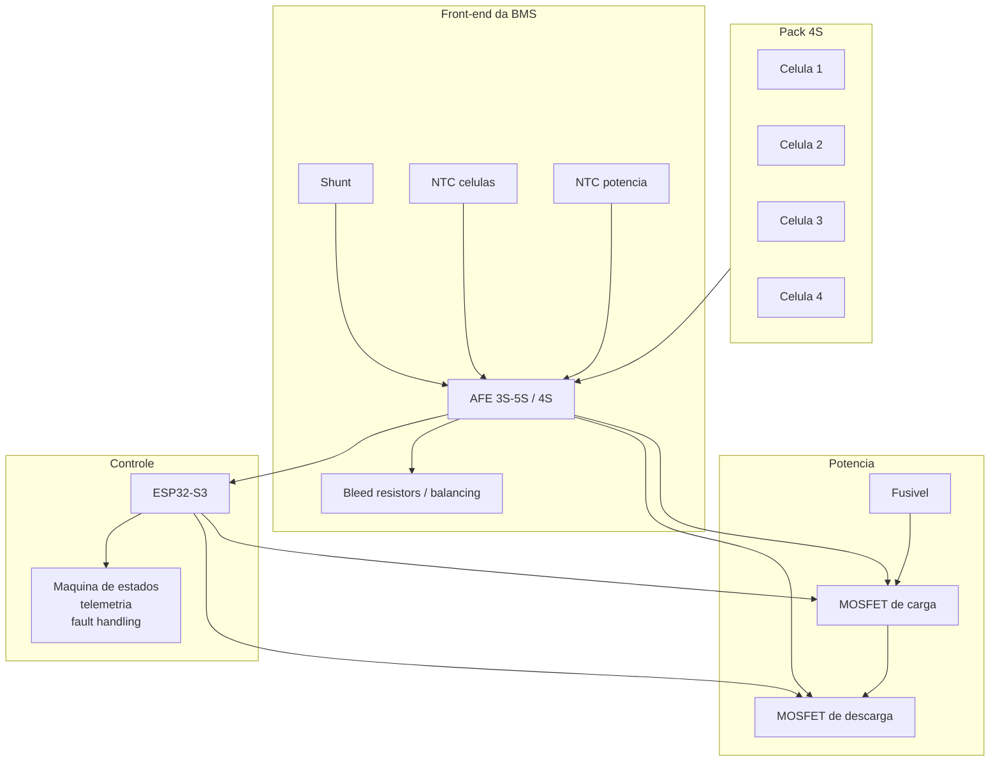
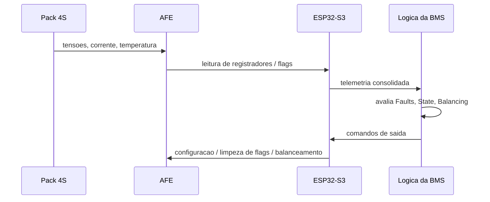

# AFE em BMS

## Objetivo

Este documento explica o papel do `AFE` em uma `BMS`, com foco em packs de litio,
especialmente no contexto de uma bateria `4S` supervisionada por `ESP32-S3`.

A sigla `AFE` significa `Analog Front End`. Em uma BMS, ele e o bloco eletronico
especializado em medicao, protecao primaria e interface segura com as celulas.

## Por que usar um AFE

Em uma BMS real, nao e boa pratica medir diretamente os taps das celulas com o ADC do
microcontrolador. O problema nao e apenas resolucao de ADC: tambem entram em jogo
seguranca eletrica, ruido, modo comum, protecao contra falhas, tempo de resposta e
robustez do sistema.

Um `AFE` e usado para:

- medir tensao de cada celula com erro baixo
- medir ou apoiar a medicao de corrente do pack
- ler sensores de temperatura
- detectar falhas como `OV`, `UV`, `OCD` e `SCD`
- acionar ou apoiar balanceamento de celulas
- sinalizar eventos criticos ao microcontrolador
- proteger o pack mesmo quando o firmware nao e suficiente

## Visao de sistema

Leitura pratica:

- o `AFE` fica no caminho critico de seguranca
- o `ESP32-S3` fica no caminho critico de estrategia e comunicacao
- a protecao rapida nao deve depender somente do loop do firmware

## O que um AFE faz dentro da BMS

### 1. Medicao de tensao por celula

Essa e a funcao mais basica.

Em um pack `4S`, o AFE mede:

- `Vcell1`
- `Vcell2`
- `Vcell3`
- `Vcell4`
- tensao total do stack, em muitos dispositivos

Isso permite:

- detectar `sobretensao`
- detectar `subtensao`
- comparar as celulas para balanceamento
- calcular variaveis usadas por `SOC`, `SOH` e potencia disponivel

### 2. Medicao de corrente

Muitos AFEs trabalham com `shunt` e PGA interno ou com interface para um sensor de corrente.
Em sistemas mais completos, o AFE tambem oferece `coulomb counting`.

Isso ajuda em:

- protecao de `sobrecorrente`
- deteccao de `curto-circuito`
- integracao de carga para estimativa de estado
- classificacao do pack em carga, descarga ou repouso

### 3. Medicao de temperatura

Normalmente o AFE le `NTCs` externos.

Isso sustenta:

- bloqueio de carga abaixo da faixa segura
- bloqueio de carga e descarga acima da faixa segura
- controle de balanceamento em funcao da temperatura
- diagnostico termico das celulas e do estagio de potencia

### 4. Balanceamento de celulas

Em packs de litio, o AFE frequentemente inclui suporte a `balanceamento passivo`.

Na pratica, ele:

- monitora diferenca entre celulas
- habilita ou auxilia a habilitacao de resistores de bleed
- temporiza ou limita a duracao do balanceamento

### 5. Protecoes primarias

Alguns AFEs integram boa parte da logica de protecao:

- `OV`: overvoltage por celula
- `UV`: undervoltage por celula
- `OCD`: overcurrent in discharge
- `SCD`: short-circuit in discharge
- `OT/UT`: sobretemperatura e subtemperatura

Para projeto real, isso e importante porque o tempo de resposta de uma protecao de hardware
ou de um bloco dedicado tende a ser mais confiavel que o de um loop geral em firmware.

## Diferenca entre AFE, monitor, protetor e gauge

Na pratica de mercado, esses termos se misturam. Para projeto, vale separar assim:

- `protetor`: foco forte em cutoff e seguranca
- `monitor / AFE`: foco em medicao multicelula, falhas e interface com MCU
- `gauge`: foco em `SOC`, `SOH`, autonomia e modelagem

Em muitas arquiteturas reais, a BMS combina mais de um papel no mesmo sistema.

## Exemplo de bloco funcional para uma BMS 4S com ESP32

## Imagens de referencia

As figuras abaixo sao referencias publicas e ajudam a ilustrar o tipo de circuito que um
AFE costuma integrar ou comandar.

### Aplicacao multicelula com balanceamento passivo externo

Fonte: [Analog Devices - Passive Battery Cell Balancing](https://www.analog.com/en/technical-articles/passive-battery-cell-balancing.html)

### Balanceamento passivo por resistor bleed

Fonte: [Analog Devices - Passive Battery Cell Balancing](https://www.analog.com/en/technical-articles/passive-battery-cell-balancing.html)

## O que observar ao escolher um AFE

Para o seu projeto `4S`, os criterios mais importantes tendem a ser:

1. quantidade de celulas suportadas
2. interface com o `ESP32-S3` (`I2C`, `SPI`, daisy chain)
3. precisao de tensao por celula
4. recursos de corrente e `coulomb counting`
5. numero de entradas de temperatura
6. suporte a balanceamento
7. tipo de driver de MOSFET
8. diagnosticos e tolerancia a falhas
9. consumo em repouso
10. complexidade da topologia

## Exemplos de familias de AFE

### Exemplo 1: TI `BQ76920`

Perfil:

- familia para `3S` a `5S`
- interface `I2C`
- medicao de celula, termistor e corrente
- recursos de `OV`, `UV`, `OCD`, `SCD`
- suporte a balanceamento e drivers de `CHG/DSG`

Por que interessa ao seu caso:

- o seu pack e `4S`
- o barramento `I2C` conversa bem com `ESP32-S3`
- e uma familia pensada exatamente para packs pequenos e medios

Fonte: [TI - BQ76920](https://www.ti.com/product/BQ76920)

### Exemplo 2: NXP `MC33771C`

Perfil:

- controlador de celulas para stacks maiores
- medicao de tensao, corrente e temperatura
- balanceamento embutido
- foco forte em diagnosticos e seguranca funcional
- comunicacao `SPI` e daisy chain

Quando faz mais sentido:

- packs maiores
- topologias com maior exigencia de diagnostico
- evolucao futura para sistemas com mais celulas e mais rigor de seguranca

Fonte: [NXP - MC33771C](https://www.nxp.com/products/MC33771C)

### Exemplo 3: Analog Devices `LTC6811`

Perfil:

- mede ate `12` celulas por dispositivo
- stackeavel
- alta precisao
- recursos de temperatura e balanceamento
- adequado para strings de alta tensao

Quando faz mais sentido:

- sistemas com muitas celulas em serie
- projetos com foco em precisao e arquitetura escalavel

Fonte: [Analog Devices - LTC6811-1](https://www.analog.com/en/products/ltc6811-1.html)

## Comparacao rapida para o contexto deste projeto

| Familia | Faixa de celulas | Interface | Melhor encaixe no projeto atual |
| --- | --- | --- | --- |
| `BQ76920` | `3S a 5S` | `I2C` | muito bom para uma BMS `4S` com `ESP32-S3` |
| `MC33771C` | ate `14` canais | `SPI` / daisy chain | forte para evolucao futura e maior sofisticacao |
| `LTC6811` | ate `12` celulas por CI | `SPI` / isoSPI | excelente para sistemas maiores ou stackeaveis |

## Exemplo de decisao para uma BMS 4S com ESP32-S3

Para o estado atual do projeto, a recomendacao mais pragmatica continua sendo:

- `AFE 3S-5S`
- interface `I2C`
- suporte a pelo menos `2 NTC`
- balanceamento passivo
- protecao `OV/UV/OCD/SCD`
- driver para `MOSFETs` de carga e descarga ou facil interface com driver externo

Em termos de arquitetura, isso reduz:

- complexidade de firmware
- quantidade de componentes discretos
- risco de erro de medicao de celula

## Exemplo de como o AFE entra no fluxo de software

## Cuidados de projeto ao usar AFE

Mesmo com um bom AFE, alguns erros continuam comuns:

- aterramento ruim entre medicao e potencia
- filtro RC mal dimensionado nas entradas de celula
- shunt mal posicionado
- ignorar limites termicos de resistores de balanceamento
- escolher um AFE sem numero suficiente de entradas de temperatura
- depender do microcontrolador para tudo, inclusive falhas rapidas

## Recomendacao pratica para este repositorio

Se a meta e levar esta BMS `4S` para uma placa real, a sequencia recomendada e:

1. fixar uma familia de `AFE`
2. desenhar o esquematico ao redor do AFE
3. mapear o barramento com o `ESP32-S3`
4. trocar o `MockBatteryMonitor` por um driver do AFE escolhido
5. validar leitura de tensao, corrente e temperatura em bancada
6. validar falhas e balanceamento antes de conectar um pack real

## Bibliografia recomendada

### Livros

- ANDREA, Davide. *Battery Management Systems for Large Lithium-Ion Battery Packs*. Norwood, MA: Artech House, 2010. Fonte: [Artech House / SAE Mobilus](https://saemobilus.sae.org/books/battery-management-systems-large-lithium-ion-battery-packs-b-art-003)
- PLETT, Gregory L. *Battery Management Systems, Volume I: Battery Modeling*. Norwood, MA: Artech House, 2015. Fonte: [Artech House](https://us.artechhouse.com/Battery-Management-Systems-Volume-1-Battery-Modeling-P1753.aspx)
- PLETT, Gregory L. *Battery Management Systems, Volume II: Equivalent-Circuit Methods*. Norwood, MA: Artech House, 2015. Fonte: [Artech House](https://us.artechhouse.com/Battery-Management-Systems-Volume-II-Equivalent-Circuit-Methods-P1775.aspx)
- WARNER, John T. *The Handbook of Lithium-Ion Battery Pack Design: Chemistry, Components, Types, and Terminology*. 2. ed. Oxford: Elsevier, 2024. Fonte: [Elsevier](https://shop.elsevier.com/books/the-handbook-of-lithium-ion-battery-pack-design/warner/978-0-443-13807-2)

### Fontes tecnicas primarias

- TEXAS INSTRUMENTS. *BQ76920 data sheet, product information and support*. Disponivel em: [https://www.ti.com/product/BQ76920](https://www.ti.com/product/BQ76920)
- NXP SEMICONDUCTORS. *MC33771C | 14-Channel Li-Ion Battery Cell Controller IC*. Disponivel em: [https://www.nxp.com/products/MC33771C](https://www.nxp.com/products/MC33771C)
- ANALOG DEVICES. *LTC6811-1 Datasheet and Product Info*. Disponivel em: [https://www.analog.com/en/products/ltc6811-1.html](https://www.analog.com/en/products/ltc6811-1.html)
- ANALOG DEVICES. *Passive Battery Cell Balancing*. Disponivel em: [https://www.analog.com/en/technical-articles/passive-battery-cell-balancing.html](https://www.analog.com/en/technical-articles/passive-battery-cell-balancing.html)
- TEXAS INSTRUMENTS. *Protector, Monitor or Gauge - Selecting the Correct Battery Electronics for Your Li-ion-powered System*. Disponivel em: [https://www.ti.com/document-viewer/ja-jp/lit/html/SSZT466](https://www.ti.com/document-viewer/ja-jp/lit/html/SSZT466)
