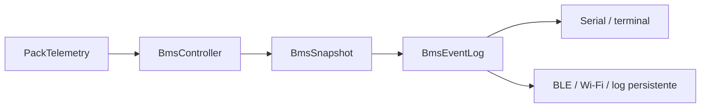

# Diagnostico e Eventos da BMS

## Objetivo

Esta pagina descreve a trilha de diagnostico que a base atual do firmware ja oferece.
Ela existe para responder tres perguntas importantes:

- o que acabou de acontecer na BMS
- por que a BMS mudou de estado
- quais falhas apareceram, mudaram ou foram liberadas

## O que ja existe no firmware

O projeto agora conta com um `BmsEventLog` em memoria que registra um historico circular
dos eventos mais relevantes da BMS.

Caracteristicas atuais:

- buffer circular com `32` eventos
- armazenamento em `RAM`
- leitura por `Serial` via `show-events`
- limpeza manual via `clear-events`
- registro automatico a partir do `BmsSnapshot`

## Eventos registrados

O firmware ja registra:

- boot do sistema
- transicoes de estado
- falhas levantadas
- mudancas na composicao das falhas ativas
- liberacao de falhas
- inicio de `precharge`
- conclusao de `precharge`
- timeout de `precharge`
- correcao de `SOC` por `OCV`
- mudancas de configuracao em runtime
- pedido manual de limpeza de falhas

## Fluxo de diagnostico



Leitura pratica:

- o `BatteryMonitor` fornece telemetria
- o `BmsController` resolve faults, estado, saidas e estimadores
- o `BmsSnapshot` consolida a fotografia do ciclo
- o `BmsEventLog` detecta mudancas relevantes entre snapshots

## Comandos de runtime relacionados

Comandos principais:

- `show-config`
- `show-events`
- `clear-events`
- `clear-faults`
- `set <path> <value>`

Exemplo de uso:

```text
show-events
clear-faults
set operation.precharge_timeout_ms 2000
show-events
```

Exemplo de saida:

```text
event-count=4
[0] t=1200ms type=boot from=startup to=startup pack=0mV current=0mA faults=none detail=system boot
[1] t=1310ms type=state from=idle to=precharge pack=15240mV current=1800mA faults=none detail=idle -> precharge
[2] t=1670ms type=precharge-done from=precharge to=precharge pack=15210mV current=1650mA faults=none detail=bus charged
[3] t=1710ms type=state from=precharge to=discharging pack=15190mV current=1600mA faults=none detail=precharge -> discharging
```

## O que este log ajuda a validar

Na pratica, esse historico ajuda a verificar:

- se o `precharge` realmente iniciou antes de liberar a descarga
- quando a BMS entrou em `Fault`
- se uma falha mudou de composicao ao longo do tempo
- se a correcao por `OCV` entrou em janela de repouso valida
- quando algum parametro foi alterado em runtime

## Limites atuais

O log atual ainda tem escopo de diagnostico local. Ele nao substitui uma camada de
telemetria completa nem uma trilha persistente de eventos.

Limites desta versao:

- o historico se perde em reset ou perda de energia
- o timestamp e relativo ao `boot`, em `ms`
- ainda nao existe exportacao estruturada para arquivo, BLE, Wi-Fi ou `CAN`
- ainda nao existe filtro por tipo de evento

## Proximo passo recomendado

Depois desta etapa, a evolucao mais natural e separar duas camadas:

1. `diagnostico em memoria` para depuracao rapida
2. `log persistente` para analise de falhas, TCC e testes de bancada

Uma sequencia segura seria:

1. manter o buffer circular em `RAM`
2. adicionar serializacao estruturada para os eventos
3. gravar eventos criticos em `NVS`, `flash` ou memoria externa
4. cruzar os eventos com resultados de ensaio de bancada

## Arquivos principais

- [Interface do log de eventos](../include/bms_event_log.h)
- [Implementacao do log de eventos](../src/bms_event_log.cpp)
- [Servico de comandos em runtime](../src/bms_runtime_config_service.cpp)
- [Bootstrap e loop principal](../src/main.cpp)
- [Maquina de estados da BMS](maquina-de-estados-bms.md)
- [Tecnicas de protecao](protecao-bms.md)
