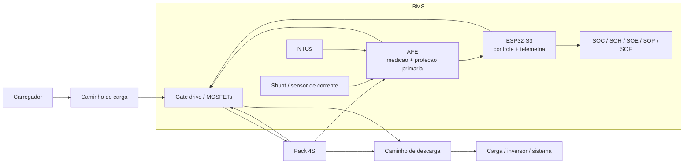
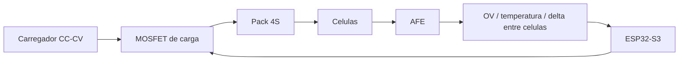
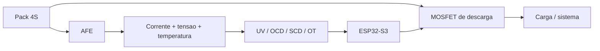
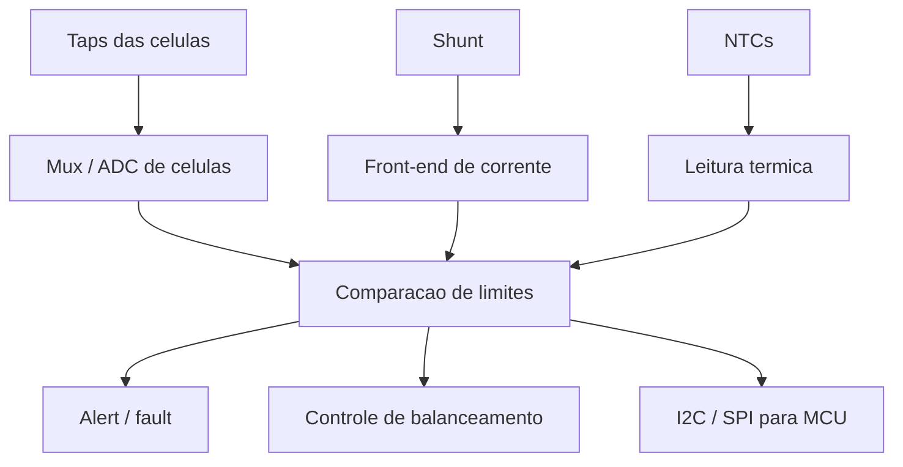
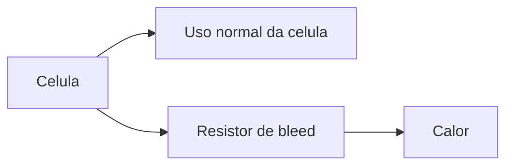
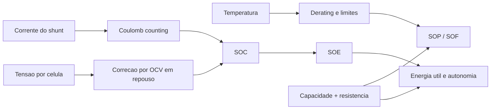

# Funcionamento da BMS

## Objetivo

Este documento explica como uma `BMS` funciona em nivel de arquitetura, operacao e
estimativa de estado, com foco no contexto deste projeto: uma bateria `4S` com `ESP32-S3`.

Tambem compara metodologias de implementacao, balanceamento e processamento de dados,
indicando qual caminho faz mais sentido para a primeira versao da placa.

## O que uma BMS realmente faz

Uma `Battery Management System` nao e apenas um circuito que mede tensao. Em um pack de
litio, a BMS precisa combinar:

- medicao por celula
- medicao de corrente
- medicao de temperatura
- protecao de carga e descarga
- controle de contatores ou `MOSFETs`
- balanceamento
- estimativa de estado do pack
- telemetria e diagnostico

## Arquitetura funcional de uma BMS

Leitura pratica:

- o `AFE` fica no caminho critico de medicao e seguranca
- o `ESP32-S3` fica no caminho critico de estrategia, telemetria e estado
- o `shunt` informa o fluxo real de corrente
- os `MOSFETs` definem se o pack pode ou nao carregar e descarregar

## Metodologias de arquitetura

### 1. MCU medindo tudo diretamente

Descricao:

- o microcontrolador mede taps das celulas, corrente e temperatura sem um front-end dedicado

Vantagens:

- custo inicial aparentemente menor
- menos componentes

Limites:

- pior robustez eletrica
- pior imunidade a ruido e modo comum
- protecao rapida fica dependente do firmware
- arquitetura arriscada para pack `4S`

Recomendacao para este projeto:

- `nao utilizar`

### 2. MCU + AFE + balanceamento passivo

Descricao:

- um `AFE` mede celulas, corrente e temperatura
- o `ESP32-S3` executa a logica de estado e telemetria
- o balanceamento usa resistores de bleed

Vantagens:

- boa separacao entre seguranca e estrategia
- custo coerente para pack pequeno
- menor complexidade de hardware
- bom encaixe para `4S`

Limites:

- parte da energia e dissipada em calor no balanceamento
- estimativa de estado ainda precisa de algoritmo bem ajustado

Recomendacao para este projeto:

- `utilizar na primeira versao`

### 3. MCU + AFE + gauge dedicado + balanceamento ativo

Descricao:

- alem do `AFE`, o sistema usa funcoes mais avancadas de fuel gauging e equalizacao de energia

Vantagens:

- melhor eficiencia de balanceamento
- melhor refinamento de `SOC`, `SOE`, `SOP` e autonomia
- mais escalavel para packs grandes

Limites:

- hardware mais caro
- controle mais complexo
- maior esforco de validacao

Recomendacao para este projeto:

- `deixar como evolucao futura`

## Qual metodologia usar nesta BMS 4S

Para a sua BMS `4S` com `ESP32-S3`, a combinacao mais coerente hoje e:

- `AFE 3S-5S / 4S` para medicao por celula e protecoes primarias
- `shunt` para medicao de corrente
- `ESP32-S3` para maquina de estados, telemetria e configuracao
- `balanceamento passivo`
- `coulomb counting` com correcao periodica por tensao em repouso

Essa combinacao entrega:

- arquitetura segura
- custo controlado
- baixa complexidade para a primeira placa
- caminho claro para evoluir depois para `gauge` mais sofisticado ou balanceamento ativo

## Charging e Discharging

### Como a BMS enxerga a carga

No modo `Charging`, o carregador empurra corrente para o pack. A BMS precisa:

- liberar o caminho de carga
- bloquear o caminho se qualquer celula entrar em `OV`
- observar temperatura minima e maxima de carga
- reduzir ou bloquear carga se houver desbalanceamento severo
- acionar balanceamento perto do topo da carga

### Como a BMS enxerga a descarga

No modo `Discharging`, o pack fornece energia para a carga. A BMS precisa:

- liberar o caminho de descarga
- executar `pre-charge` antes de fechar a descarga principal, quando a aplicacao exigir
- bloquear descarga em `UV`, `OCD` ou `SCD`
- limitar potencia disponivel se temperatura subir
- atualizar throughput e energia restante

### Metodo de carga recomendado

Para litio, o metodo mais comum e `CC-CV`:

- `CC`: corrente constante ate a celula se aproximar da tensao alvo
- `CV`: tensao constante com a corrente caindo ao final da carga

O importante aqui e separar papeis:

- o `carregador` executa a estrategia eletroquimica de carga
- a `BMS` supervisiona se a carga pode continuar

Para esta BMS:

- use um carregador adequado ao quimico e a tensao do pack
- deixe a BMS como autoridade de permissao e corte

### Pre-charge no contexto da descarga

Em muitas aplicacoes, a descarga nao deve fechar o caminho principal de uma vez quando existe
capacitor grande no barramento de saida. Nesse caso, a BMS usa um caminho resistivo ou dedicado
de `pre-charge` para subir a tensao do barramento antes de ligar o MOSFET principal.

Sequencia pratica:

1. detectar pedido de descarga
2. habilitar `precharge`
3. observar o delta entre `pack_voltage` e `output_voltage`
4. liberar `discharge` principal quando o delta cair abaixo do limite
5. entrar em `Fault` se o barramento nao responder dentro do tempo configurado

### Imagem de referencia: resumo funcional da BMS

Fonte: [MathWorks - What Is a Battery Management System (BMS)?](https://se.mathworks.com/discovery/battery-management-system.html)

### Imagem de referencia: carga em CC-CV

Fonte: [MathWorks - What Is a Battery Management System (BMS)?](https://se.mathworks.com/discovery/battery-management-system.html)

## O que e o AFE

`AFE` significa `Analog Front End`.

Na BMS, ele e o bloco especializado que fica entre o pack e o controlador. Em vez de jogar a
medicao critica diretamente no ADC do microcontrolador, o `AFE` oferece:

- medicao de tensao por celula
- medicao ou suporte a medicao de corrente
- leitura de `NTCs`
- comparadores e limites de protecao
- suporte a balanceamento
- saidas de `fault`, `alert`, `CHG` e `DSG`, dependendo da familia

### AFE, protetor, monitor e gauge nao sao a mesma coisa

- `protetor`: prioriza corte e seguranca
- `monitor`: prioriza medicao e diagnostico
- `AFE`: geralmente combina monitoramento, protecao primaria e interface analogica
- `gauge`: estima `SOC`, `SOH`, energia e autonomia

Para a sua placa:

- trate o `AFE` como bloco obrigatorio
- considere `gauge` como opcional ou evolutivo

## Equilibrio das tensoes: balanceamento passivo e ativo

O objetivo do balanceamento e reduzir o delta de tensao entre as celulas. Isso melhora:

- uso de capacidade do pack
- comportamento no topo da carga
- uniformidade entre celulas
- previsibilidade de `SOC`

### Balanceamento passivo

Como funciona:

- a BMS drena energia das celulas mais altas por um resistor de bleed

Vantagens:

- simples
- barato
- facil de validar

Limites:

- dissipa calor
- nao transfere energia entre celulas
- pode ser lento

Tecnica tipica:

- resistor em paralelo com a celula
- transistor ou chave controlada pelo `AFE`

### Balanceamento ativo

Como funciona:

- a BMS move energia de uma celula mais carregada para outra menos carregada ou para o stack

Vantagens:

- maior eficiencia
- menos dissipacao termica
- melhor encaixe para packs grandes e de alta energia

Limites:

- hardware mais complexo
- controle mais dificil
- custo maior

Tecnicas comuns:

- `switched capacitor`
- `inductive buck-boost`
- `flyback / transformer based`

### O que usar nesta BMS

Para esta BMS `4S`, a recomendacao e:

- `balanceamento passivo` na primeira versao

Use balanceamento ativo apenas se voce tiver uma meta clara de:

- eficiencia muito maior
- ciclos rapidos de equalizacao
- pack mais valioso ou com mais celulas

### Imagem de referencia: balanceamento passivo por resistor

Fonte: [Analog Devices - Passive Battery Cell Balancing](https://www.analog.com/en/resources/technical-articles/passive-battery-cell-balancing.html)

### Imagem de referencia: AFE multicelula com balanceamento passivo

Fonte: [Analog Devices - Passive Battery Cell Balancing](https://www.analog.com/en/resources/technical-articles/passive-battery-cell-balancing.html)

### Imagem de referencia: balanceamento ativo

Fonte: [MathWorks - What Is a Battery Management System (BMS)?](https://se.mathworks.com/discovery/battery-management-system.html)

## Contador de Coulomb e processamento de dados

### O que e um contador de Coulomb

O `coulomb counter` integra a corrente ao longo do tempo para estimar quanta carga entrou ou
saiu da bateria.

Em termos praticos:

- se a corrente entra no pack, a carga acumulada sobe
- se a corrente sai do pack, a carga acumulada desce

Expressao pratica:

- `delta_Ah = I * delta_t / 3600`

onde:

- `I` esta em ampere
- `delta_t` esta em segundos

### Por que ele e importante

Medir apenas tensao nao basta, porque:

- a curva `OCV x SOC` nao e linear
- a tensao muda com carga, descarga e temperatura
- sob corrente, a tensao terminal nao representa so o estado quimico

O contador de Coulomb ajuda a acompanhar:

- consumo acumulado
- throughput de carga e descarga
- energia restante, quando combinado com tensao
- autonomia estimada

### Pipeline de processamento recomendado

### Metodologias para estimar estado da bateria

#### Metodo 1: tensao apenas

Vantagens:

- simples

Limites:

- ruim sob carga
- sensivel a temperatura
- ruim para packs em uso dinamico

#### Metodo 2: Coulomb counting puro

Vantagens:

- acompanha throughput real
- responde bem a perfis dinamicos

Limites:

- deriva com erro de offset e ganho
- precisa de referencia inicial

#### Metodo 3: Coulomb counting + OCV

Vantagens:

- bom compromisso entre simplicidade e desempenho
- corrige deriva quando o pack entra em repouso

Limites:

- precisa de tabela `OCV x SOC`
- correcao depende de janela de repouso

#### Metodo 4: observadores e filtros

Exemplos:

- `Kalman filter`
- `extended Kalman filter`
- observadores baseados em circuito equivalente

Vantagens:

- melhor precisao em sistemas mais exigentes

Limites:

- precisa de modelagem e identificacao
- mais complexo de implementar e validar

### O que usar nesta BMS

Para a primeira versao da sua BMS:

- use `coulomb counting + correcao por OCV`

Nao comecaria com `EKF` ou tecnicas mais avancadas antes de:

- ter dados reais do pack
- ter curva `OCV x SOC`
- validar corrente, temperatura e impedancia em bancada

### Imagem de referencia: sistema de fuel gauging

Fonte: [Analog Devices - Lithium-Ion Cell Fuel Gauging With Maxim Battery-Monitor ICs](https://www.analog.com/en/resources/technical-articles/2022/07/16/06/39/lithiumion-cell-fuel-gauging-with-maxim-battery-monitor-ics.html)

### Imagem de referencia: Enhanced Coulomb Counting

Fonte: [Analog Devices - A Closer Look at SOC and SOH Estimation Techniques](https://www.analog.com/en/resources/technical-articles/a-closer-look-at-state-of-charge-and-state-health-estimation-tech.html)

## SOC, SOH, SOF e outras siglas importantes

### SOC

`State of Charge`

Significa:

- quanto de carga ainda resta em relacao a capacidade utilizavel

Uso pratico:

- percentual de bateria

### SOH

`State of Health`

Significa:

- quao degradada a bateria esta em relacao ao estado novo

Praticamente costuma combinar:

- perda de capacidade
- aumento de resistencia interna

### SOE

`State of Energy`

Significa:

- quanta energia ainda pode ser entregue

Diferenca para `SOC`:

- `SOC` fala de carga
- `SOE` fala de energia util

### SOP

`State of Power`

Significa:

- quanta potencia o pack pode fornecer ou absorver naquele instante

Depende de:

- tensao
- corrente maxima
- temperatura
- resistencia interna
- `SOH`

### SOF

`State of Function`

Na pratica, pode ser tratado como:

- um indicador de capacidade operacional atual do pack
- uma leitura de quanto o sistema deve limitar funcao ou desempenho para preservar seguranca e vida util

Observacao importante:

- `SOF` e menos padronizado que `SOC`, `SOH`, `SOE` e `SOP`
- para esta BMS, vale usar `SOF` como indice supervisor derivado de `SOC + SOH + temperatura + faults`

### Outras siglas uteis

- `OCV`: open-circuit voltage
- `DOD`: depth of discharge
- `CC-CV`: constant current / constant voltage
- `DCIR`: direct current internal resistance
- `ESR`: equivalent series resistance
- `OV`: overvoltage
- `UV`: undervoltage
- `OCD`: overcurrent in discharge
- `OCC`: overcurrent in charge
- `SCD`: short-circuit in discharge
- `OT`: overtemperature
- `UT`: undertemperature

## Recomendacao final para este projeto

Se o objetivo e fazer uma BMS `4S` robusta, didatica e viavel, eu seguiria esta linha:

1. `AFE dedicado` para medicao segura e protecao primaria
2. `ESP32-S3` como supervisor, telemetria e controle de alto nivel
3. `carregador CC-CV` externo, com permissao da BMS
4. `balanceamento passivo`
5. `shunt + coulomb counting`
6. `SOC` por coulomb counting com correcao por `OCV`
7. `SOH` por tendencia de capacidade e resistencia interna
8. `SOP` e `SOF` como limites dinamicos de corrente e funcao

## O que a base atual do firmware ja implementa

Na base atual do repositorio, o firmware ja evoluiu para incluir:

- histerese de tensao, corrente e temperatura
- `short-circuit discharge` explicito no modelo de falhas
- latch de falha com politica de liberacao configuravel
- `precharge` com estado dedicado, timeout e delta de barramento
- `charging` e `discharging` guiados por janela de corrente, temperatura e fim de carga
- balanceamento passivo condicionado por corrente e temperatura
- `coulomb counting` com correcao por `OCV` em repouso
- snapshots com `SOC`, `SOH`, `SOE`, `SOP` e `SOF`
- servico de override de configuracao por `Stream`, iniciando na `Serial`
- historico circular de eventos em memoria para faults, estados, `precharge` e `OCV`
- camada de `BatteryMonitor` pronta para combinar `AFE` real e medicao auxiliar

Esses estimadores ainda sao de primeira aproximacao. O passo seguinte continua sendo validar em bancada
o shunt, a curva `OCV x SOC`, a resistencia aparente do pack e os thresholds reais de protecao.

## Leituras complementares

- [docs/afe-em-bms.md](/C:/Users/peter/Documents/GitHub/BMS-ESP32S3/docs/afe-em-bms.md)
- [docs/arquitetura-bms-4s.md](/C:/Users/peter/Documents/GitHub/BMS-ESP32S3/docs/arquitetura-bms-4s.md)
- [docs/protecao-bms.md](/C:/Users/peter/Documents/GitHub/BMS-ESP32S3/docs/protecao-bms.md)

## Referencias

- [MathWorks - What Is a Battery Management System (BMS)?](https://se.mathworks.com/discovery/battery-management-system.html)
- [Analog Devices - Passive Battery Cell Balancing](https://www.analog.com/en/resources/technical-articles/passive-battery-cell-balancing.html)
- [Analog Devices - Simplicity Wins: Part 3](https://www.analog.com/en/resources/technical-articles/simplicity-wins-part-3.html)
- [Analog Devices - Simplicity Wins: Part 4](https://www.analog.com/en/resources/technical-articles/simplicity-wins-part-4.html)
- [Analog Devices - Lithium-Ion Cell Fuel Gauging With Maxim Battery-Monitor ICs](https://www.analog.com/en/resources/technical-articles/2022/07/16/06/39/lithiumion-cell-fuel-gauging-with-maxim-battery-monitor-ics.html)
- [Analog Devices - A Closer Look at SOC and SOH Estimation Techniques](https://www.analog.com/en/resources/technical-articles/a-closer-look-at-state-of-charge-and-state-health-estimation-tech.html)
- [foxBMS 2 - State estimation](https://docs.foxbms.org/software/modules/application/algorithm/state-estimation/state-estimation.html)
- [foxBMS 2 - SOC: Coulomb Counting](https://docs.foxbms.org/software/modules/application/algorithm/state-estimation/soc/soc_counting.html)
