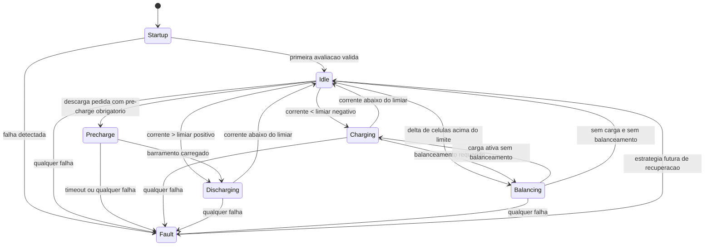

# Maquina de Estados da BMS

## Objetivo

A maquina de estados organiza a BMS em modos de operacao claros, previsiveis e auditaveis.
Ela evita que a logica de protecao fique espalhada em varios `if`s sem contexto.

Nesta base do projeto, a maquina de estados responde a quatro grupos de informacao:

- telemetria do pack
- falhas detectadas
- pedido de balanceamento
- regras de seguranca do estado atual

## Estados atuais

Os estados definidos no firmware sao:

- `Startup`
- `Idle`
- `Precharge`
- `Charging`
- `Discharging`
- `Balancing`
- `Fault`

## Filosofia da avaliacao

A cada ciclo de controle, a BMS faz:

1. le a telemetria das celulas, corrente e temperatura
2. avalia falhas
3. decide se existe pedido de balanceamento
4. resolve o estado pedido pela logica
5. aplica guardas de seguranca do estado
6. atualiza o estimador de estado da bateria
7. publica um snapshot com estado, saidas e metricas associadas

## Prioridade de decisao

A prioridade atual de resolucao e:

1. `Fault`
2. `Precharge` quando a descarga foi pedida e o barramento ainda nao esta carregado
3. `Charging` ou `Balancing` quando houver corrente de carga
4. `Discharging`
5. `Balancing` quando o pack estiver em repouso
6. `Idle`

O estado `Startup` e um guarda inicial. Na primeira atualizacao, a BMS segura as saidas em estado
seguro e publica `Startup` como estado corrente. A partir do ciclo seguinte, ela entra no estado
pedido pela telemetria.

## Diagrama de estados

## Significado de cada estado

### `Startup`

Funcao:

- fase de boot e primeira validacao

Comportamento atual:

- MOSFETs desligados
- balanceamento desligado
- avalia a telemetria, mas nao libera potencia no primeiro ciclo

### `Idle`

Funcao:

- pack saudavel, sem corrente relevante e sem balanceamento ativo

Comportamento atual:

- carga e descarga permitidas
- sem resistor de balanceamento ativo

### `Charging`

Funcao:

- corrente de carga detectada dentro dos limites configurados

Comportamento atual:

- caminho de carga habilitado
- balanceamento desligado enquanto nao houver pedido

### `Precharge`

Funcao:

- carregar o barramento de saida por um caminho controlado antes de fechar a descarga principal

Comportamento atual:

- habilita a saida de `precharge`
- mantem o caminho principal de descarga desligado
- observa o delta entre `pack_voltage` e `output_voltage`
- entra em `Fault` se o barramento nao atingir o delta alvo no tempo configurado

### `Discharging`

Funcao:

- corrente de descarga detectada dentro dos limites configurados

Comportamento atual:

- caminho de descarga habilitado
- balanceamento desligado

### `Balancing`

Funcao:

- uma ou mais celulas estao acima do limiar de balanceamento e acima das demais

Comportamento atual:

- resistores de bleed podem ser habilitados
- pode acontecer durante carga ou em repouso
- nao deve acontecer em falha critica

### `Fault`

Funcao:

- existe ao menos uma falha ativa

Comportamento atual:

- MOSFETs desligados
- balanceamento desligado
- operacao entra em modo seguro
- falhas podem permanecer latched conforme a politica de recuperacao

## Structs que amarram estado e valores

Para nao deixar o estado solto no codigo, a base agora usa duas estruturas complementares.

### 1. `BmsStateDefinition`

Essa estrutura representa o catalogo estatico dos estados.

Campos:

- `state`
- `name`
- `summary`
- `allows_charge_path`
- `allows_discharge_path`
- `allows_balancing`
- `is_fault_state`

Ela existe em uma tabela `constexpr` com todos os estados definidos em `BmsState`.
Como a enum tem o valor `Count`, fica facil garantir que a tabela cubra todos os estados.

Uso principal:

- documentacao do comportamento esperado
- nome amigavel do estado
- consistencia entre firmware e documentacao

### 2. `BmsStateContext`

Essa estrutura representa o estado dinamico do ciclo atual.

Campos:

- `previous`
- `current`
- `requested`
- `charging_detected`
- `discharging_detected`
- `balancing_requested`
- `fault_active`
- `precharge_active`
- `precharge_complete`
- `precharge_timed_out`
- `metrics`

Uso principal:

- depuracao
- telemetria
- rastreio de transicoes
- validacao da logica da BMS

### 3. `BmsStateMetrics`

Essa estrutura guarda os valores numericos associados ao ciclo atual:

- `min_cell_voltage_mv`
- `max_cell_voltage_mv`
- `cell_voltage_delta_mv`
- `output_voltage_mv`
- `precharge_delta_mv`
- `min_temperature_deci_c`
- `max_temperature_deci_c`
- `pack_current_ma`

Esses campos ajudam a responder:

- por que a BMS entrou em `Balancing`
- por que saiu de `Charging`
- qual foi a dispersao das celulas no ciclo
- qual foi a faixa de temperatura observada

### 4. `BmsSnapshot`

O `BmsSnapshot` virou o ponto unico de observacao da BMS em cada ciclo.

Ele agrupa:

- `telemetry`
- `raw_faults`
- `faults`
- `outputs`
- `state_context`

Isso facilita log, serializacao, testes e envio de telemetria para BLE, Wi-Fi ou CAN no futuro.

Na base atual, o `BmsSnapshot` tambem alimenta um `BmsEventLog` em memoria, que registra:

- mudancas de estado
- faults levantadas, alteradas e liberadas
- eventos de `precharge`
- correcao por `OCV`
- mudancas de configuracao em runtime

## Estrutura recomendada no firmware

O padrao recomendado para evoluir a logica e:

1. manter `BmsState` como identificador enxuto do modo atual
2. manter `BmsStateDefinition` como tabela fixa de todos os estados
3. manter `BmsStateContext` como fotografia do ciclo
4. manter `BmsSnapshot` como envelope de publicacao

Esse arranjo ajuda porque separa:

- o que o estado e
- o que o estado permite
- o que aconteceu neste ciclo

## Melhorias futuras recomendadas

Para uma maquina de estados mais madura, valem os proximos passos:

1. adicionar temporizacao minima por estado
2. separar `Fault` em falha bloqueante total e degradacao parcial de caminho
3. registrar o motivo dominante da transicao
4. persistir historico de eventos criticos para diagnostico pos-falha
5. adicionar um criterio mais rico de pre-charge com medicao dedicada do barramento
